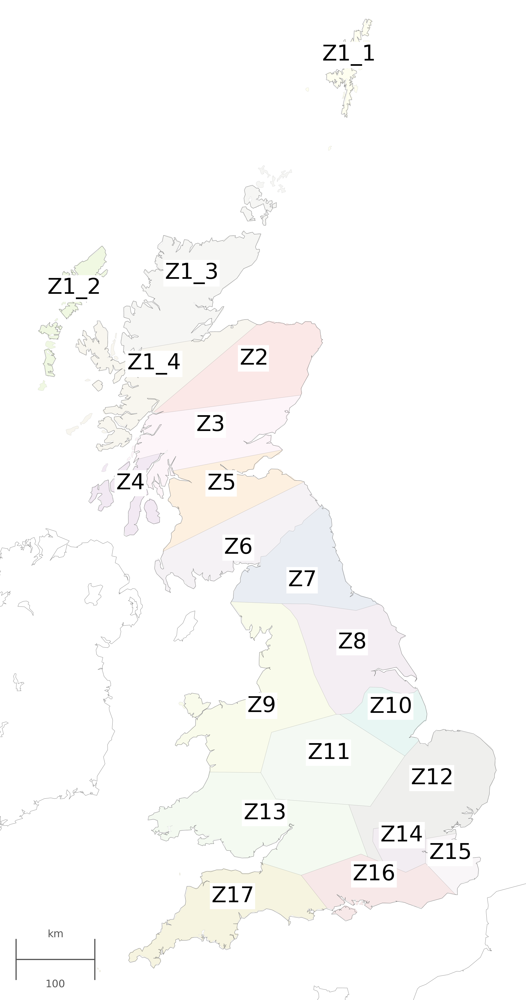

# UK-Calliope model

## Installation

To install, it is recommended to follow the [instructions for installing Calliope](http://docs.callio.pe/en/stable/user/installation.html), which includes installation of the [Anaconda Python distribution](https://www.continuum.io/downloads).

The included ``requirements.yml`` file lists the required packages.

The model is compatible with version ``0.6`` of the Calliope framework. See below for older versions.

## Overview

The main model specification is in ``model.yaml``. Timeseries data are in ``data``, location and tech specifications in ``locations`` and ``techs``, respectively.

To run the model over a week of data for testing:

```bash
calliope run model.yaml --scenario=run_test  --save_netcdf=output.nc --save_plots=plots.html
```

To generate some sample scenario runs:

```bash
make run_renewable_shares.sh
```

## Older versions

Older versions of the model used in publications are tagged on GitHub:

* Pfenninger 2017: [`paper-pfenninger-2017`](https://github.com/sjpfenninger/uk-calliope/tree/paper-pfenninger-2017)
* Pfenninger and Keirstead 2015: [`paper-pfenninger-keirstead-2015`](https://github.com/sjpfenninger/uk-calliope/tree/paper-pfenninger-keirstead-2015)

## Zones



A [GeoJSON file](zones.geojson) and a [shapefile](zones.zip) with polygons of the zones used are included.

## Sources

See [Sources](SOURCES.md) for data sources used.

## License

[](https://creativecommons.org/licenses/by-sa/4.0/)

This work (with exceptions listed below) is licensed under a [Creative Commons Attribution-ShareAlike 4.0 International License](http://creativecommons.org/licenses/by-sa/4.0/).

License exceptions:

* Electricity demand data (from National Grid at http://www.nationalgrid.com/uk/Electricity/Data/Demand+Data/) is not included in this license
